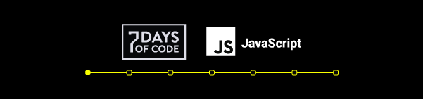

 

# Dia 01 - Trabalhando com operadores lógicos em Javascript

## Tecnologias Usadas

- Javascript

## Operadores Lógicos

| Operador | Operação         | Exemplo   |
| -------- | ---------------- | --------- |
| >        | Maior que        | (a > b)   |
| <        | Menor que        | (a < b)   |
| >=       | Maior ou igual a | (a >= b)  |
| <=       | Menor ou igual a | (a <= b)  |
| ==       | Igual a          | (a == b)  |
| !=       | Diferente de     | (a !== b) |
| ===      | Idêntico a       | (a === b) |
| !==      | Não idêntico a   | (a !== b) |
| &&       | E/and            | (a && b)  |
| ll       | Ou/or            | (a ll b)  |

## Diferença entre == e ===

Usamos == para comparar apenas valores, sem nos importar se são valores do mesmo tipo. Aqui, comparamos se o número 3 é igual à string 3:

> 3 == '3' (true)

Usamos === para comparar se os valores e os tipos são iguais.

Comparar número e string

> 3 === '3' (false)

Comparar número e número

> 3 === 3 (true)

Comprar string e string

> '3' === '3' (true)

## Diferença de != e !==

> 3 != '3' (false)

> 3 !== '3' (true)

## Referências

- [Artigo da Rafa Bellerini](https://www.alura.com.br/artigos/operadores-matematicos-em-javascript?gclid=Cj0KCQiA_8OPBhDtARIsAKQu0gYUqZqgonpXyEP1_hpUl58wYAk_P3Ze4VWrxo9ftkFW9CLYOMyjO1caAlrzEALw_wcB&utm_source=ActiveCampaign&utm_medium=email&utm_content=%237DaysOfCode+-+L%C3%B3gica+JS+1%2F7%3A+Opera%C3%A7%C3%B5es+Booleanas&utm_campaign=%5BALURA+%237days+Of+Code%5D+%28L%C3%B3gica+de+Programa%C3%A7%C3%A3o+-+JavaScript%29+Dia+1%3A+Comparando+Valores&vgo_ee=F9c%2FFeXJKtFaSDiEzuuGvL35hO7C%2FF3J%2FgQB9Uu3XAY%3D)
